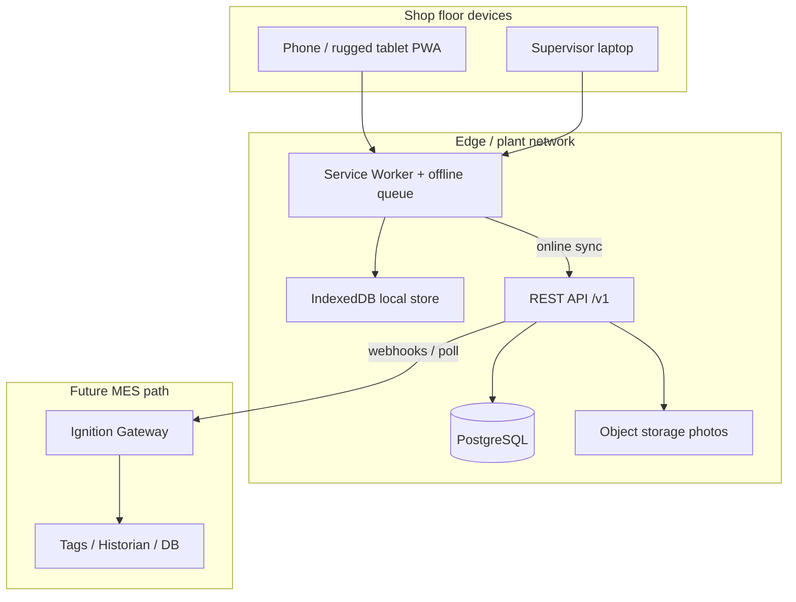
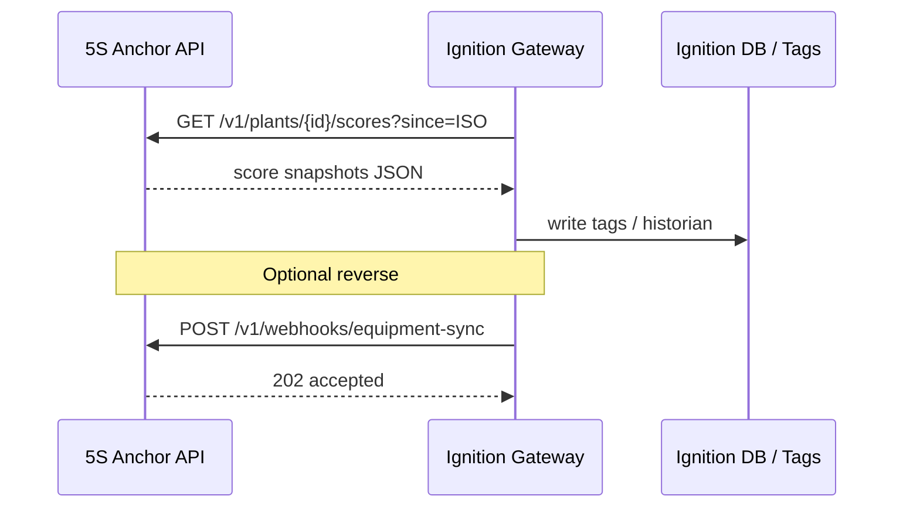

# 5S Anchor — High-Level Architecture

## System context



## Layered app architecture

```
┌──────────────────────────────────────────────────────────┐
│  UI (mobile-first screens)                               │
│  Red Tag · Audit · Dashboard · Actions · Standards       │
├──────────────────────────────────────────────────────────┤
│  Application services                                    │
│  scoring · workflow transitions · role gates · exports   │
├──────────────────────────────────────────────────────────┤
│  Repository interface (same API online & offline)        │
│  redTags.create() · audits.submit() · dashboard.query()  │
├──────────────┬───────────────────────────────────────────┤
│  Local repo  │  Remote repo (HTTP /v1)                   │
│  IndexedDB   │  Postgres via API                         │
├──────────────┴───────────────────────────────────────────┤
│  Sync engine: outbox queue, conflict policy, photo upload│
└──────────────────────────────────────────────────────────┘
```

## Offline strategy

1. **Read path** — UI always reads from IndexedDB (cache of last sync + local writes).
2. **Write path** — mutations write to IDB immediately + append to **outbox** with `clientMutationId`.
3. **Sync** — when online, flush outbox FIFO; server returns canonical IDs/timestamps; update local rows.
4. **Conflict policy (v1)** — last-writer-wins on mutable fields; **state machine transitions** reject illegal jumps (server is source of truth for workflow).
5. **Photos** — store as blobs locally; upload after metadata sync; remote URLs replace blob refs.

## Auth & roles

```
Login (demo picker or JWT)
    → session { userId, role, plantId, areaIds[] }
    → route guards + every repository method checks powers
    → server RLS / middleware mirrors the same role matrix
```

| Role | Typical access |
|------|----------------|
| Operator | Create red tags, run assigned audits, close own actions with proof |
| Supervisor | Review tags, assign actions, area dashboards, schedules |
| Manager | Plant analytics, exports, checklist config |
| Admin | Users, plants, all config, audit trail |

## Ignition integration path (future)



Documented payloads live in `docs/design/04-rest-api.md` and `docs/integration/ignition.md`.

## Security principles

- Role check on every mutating endpoint
- Soft-delete + append-only `event_log` for audit trail
- No secrets in the PWA; service role keys server-only
- Photos treated as potentially sensitive plant data (GrokLaw when multi-tenant/hosted)
